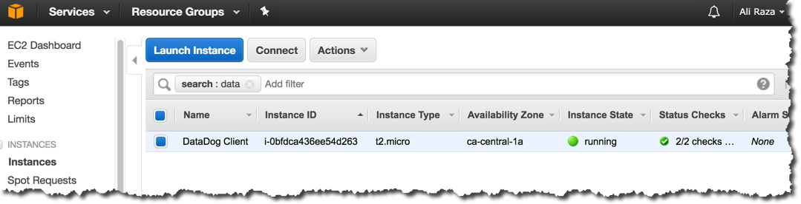
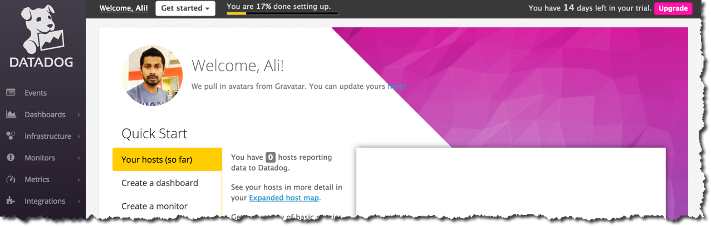
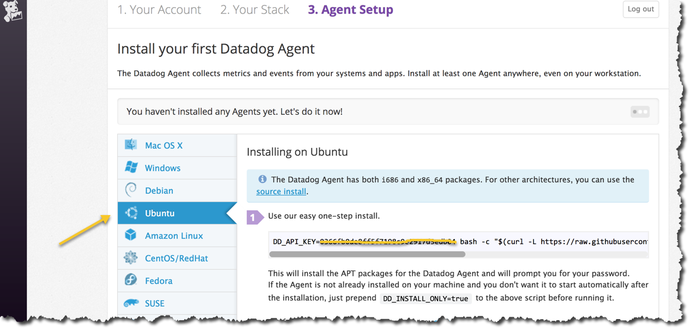
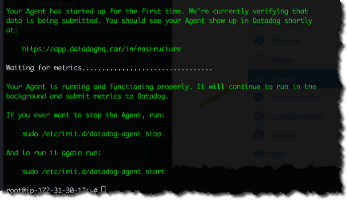
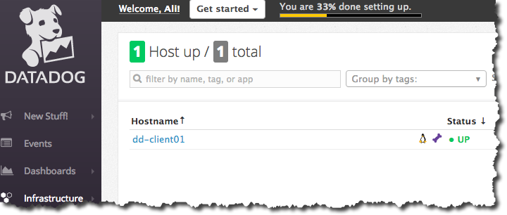
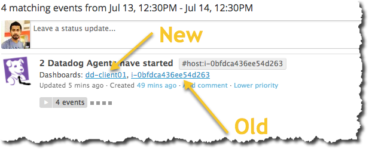
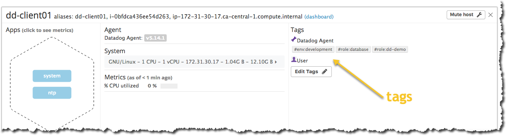

# Solved exercise for the role 'Solutions Engineer' at [Datadog](http://datadog.com)

## Candidate Information
Ali Raza  
alirazaonsite@gmail.com

### Level 0 (optional) - Setup an Ubuntu VM
* New Ubuntu VM has been setup on AWS cloud:  


### Level 1 - Collecting your Data
* Sign up and install local agent
Signed up for DataDog:  


Locate remote agent:


- Install remote agent:
To install agent run following commands:
```bash
DD_API_KEY=xxx-xxx bash -c "$(curl -L https://raw.githubusercontent.com/DataDog/dd-agent/master/packaging/datadog-agent/source/install_agent.sh)"
```
Where DD_API_KEY is the unique key we retrieved from DataDog portal.  
Ensure it is running:  
  
Alternatively, you can start, stop and check the status of datadog agent by running:  
```bash
service datadog-agent start | stop | status
```

* What is the Agent?  
In this context, agent is a piece of software which collects data generated from alerts, triggers, events, etc and send to remote server which in this case is DataDog server (endpoint). Agent runs in background and can also be setup as a service and set to start automatically so that upon reboot of machine, agent starts itself.  

* Add tags in the Agent config file and show us a screenshot of your host and its tags on the Host Map page in Datadog.  

For this step first we renamed our client host to **dd-client01**  

(Optionally) We learned that renaming the hostname will not instantly change the hostname in the datadog UI, to update the name in datadog we followed <a href="https://help.datadoghq.com/hc/en-us/articles/203764655-How-can-I-change-the-hostname-">Link</a>
The hostname key was set to **auto-detected** which means eventually it would have detected the changed name.  


After renaming host we can continue to see the original hostname in the datadog UI for the next 24 hours, however, this will be removed once the data ages out. Not to worry! DataDog is not billing for two instances, only for the connected one!  


Assume **dd-client01** is a development machine and will be running few applications such as MySQL
Lets add few tags so that we can indicate that this machine have a certain purpose:
Adding tags: #env: development, #role: database
Modify the file:
```bash
root@dd-client01:~# nano /etc/dd-agent/datadog.conf
```
Find section and edit or add if not present:
```bash
# Set the host's tags (optional)
tags: env:development, role:database, role:dd-demo
```
Restart the service and check the status:
```bash
root@dd-client01:~# service datadog-agent restart
root@dd-client01:~# service datadog-agent status
● datadog-agent.service - "Datadog Agent"
   Loaded: loaded (/lib/systemd/system/datadog-agent.service; enabled; vendor preset: enabled)
   Active: active (running) since Fri 2017-07-14 16:20:37 UTC; 4s ago
```

Show tags are associated with host:  



### Level 2 - Visualizing your Data
